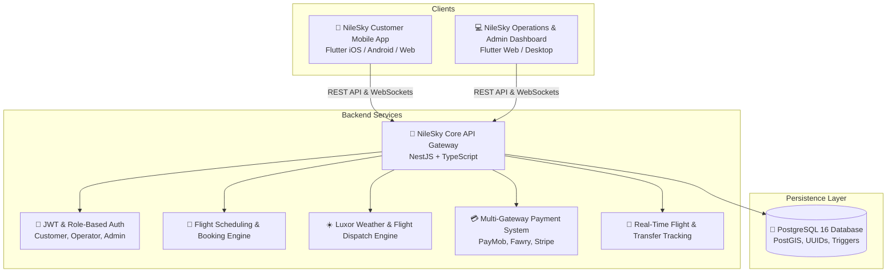

# 🎈 NileSky — Luxor Hot Air Balloon Booking & Operations Platform

[](https://flutter.dev)
[](https://nestjs.com)
[](https://www.postgresql.org)
[](https://www.typescriptlang.org)

**NileSky** is a comprehensive digital marketplace and real-time operations management platform designed specifically for the hot air balloon industry in **Luxor, Egypt** (West Bank / Valley of the Kings).

---

## 🌟 Platform Architecture Overview



---

## 📁 Repository Structure

```
nilesky/
├── backend/                  # NestJS REST API Server
│   ├── src/
│   │   ├── auth/             # JWT authentication, guards & roles
│   │   ├── users/            # Customer & staff profiles
│   │   ├── operators/        # Balloon flight operators (King Tut, Sindbad, SkyScape)
│   │   ├── packages/         # Standard, Premium, & Private VIP packages
│   │   ├── balloons/         # Balloon fleet & capacity management
│   │   ├── pilots/           # Pilot profiles, ratings, & licensing
│   │   ├── drivers/          # Transfer drivers & hotel pickup fleet
│   │   ├── flights/          # Flight templates & scheduled flights
│   │   ├── bookings/         # Booking engine & digital boarding pass generator
│   │   ├── payments/         # Multi-gateway payments (EGP, USD, EUR, GBP)
│   │   ├── reviews/          # Verified customer reviews & rating recalculation
│   │   ├── coupons/          # Discounts, promos, & referral system
│   │   ├── notifications/    # Push notifications & trip reminders
│   │   ├── weather/          # Luxor sunrise & wind safety dispatch service
│   │   ├── analytics/        # Revenue, occupancy, & flight analytics
│   │   ├── upload/           # Media upload & CDN storage
│   │   ├── database/         # Auto-seeder with realistic Luxor data
│   │   └── main.ts           # Application bootstrap & Swagger API docs
│   ├── package.json
│   └── tsconfig.json
│
├── customer_app/             # Flutter Mobile & Cross-Platform Customer App
│   ├── lib/
│   │   ├── models/           # Flight, Operator, Booking, Weather models
│   │   ├── screens/
│   │   │   ├── splash_screen.dart               # Animated branding splash
│   │   │   ├── onboarding_screen.dart           # Interactive Luxor intro
│   │   │   ├── auth_screen.dart                 # Sign in & Register
│   │   │   ├── home_screen.dart                 # Sunrise HUD, search & top operators
│   │   │   ├── explore_screen.dart              # Search, filter by price/type/operator
│   │   │   ├── flight_detail_screen.dart        # Media gallery, itinerary & safety
│   │   │   ├── operator_profile_screen.dart     # Fleet, pilots, certificates & reviews
│   │   │   ├── compare_screen.dart              # Side-by-side package comparison
│   │   │   ├── booking_flow_screen.dart         # 4-step interactive checkout
│   │   │   ├── booking_confirmation_screen.dart # QR boarding pass & add to calendar
│   │   │   ├── active_flight_screen.dart        # Real-time flight tracking & live status
│   │   │   ├── my_bookings_screen.dart          # Trip history & upcoming passes
│   │   │   ├── review_screen.dart               # Post-flight rating & photo upload
│   │   │   ├── profile_screen.dart              # User settings & preferences
│   │   │   └── language_screen.dart             # English & Arabic (العربية) selector
│   │   ├── services/         # API client & local offline cache
│   │   ├── theme/            # Luxury dark sunrise color palette
│   │   └── widgets/          # Reusable UI widgets & media viewers
│   └── pubspec.yaml
│
├── admin_panel/              # Flutter Web Operator & Admin Dashboard
│   ├── lib/
│   │   ├── screens/
│   │   │   ├── admin_shell.dart                 # Responsive sidebar & navigation
│   │   │   ├── dashboard_screen.dart            # Live operations HUD & stats
│   │   │   ├── flights_screen.dart              # Dispatch board & Go/No-Go controls
│   │   │   ├── bookings_screen.dart             # Manifests, check-in & passenger list
│   │   │   ├── operators_screen.dart            # Operator approvals & commissions
│   │   │   ├── balloons_screen.dart             # Fleet inspections & maintenance
│   │   │   ├── pilots_screen.dart               # Pilot assignments & flight hours
│   │   │   ├── drivers_screen.dart              # Vehicle transfers & pickup routes
│   │   │   ├── coupons_screen.dart              # Marketing coupons & discount rules
│   │   │   └── analytics_screen.dart            # Revenue charts & occupancy rates
│   │   ├── theme/            # Modern dark admin design system
│   │   └── main.dart
│   └── pubspec.yaml
│
└── database/
    └── schema.sql            # Full PostgreSQL schema with triggers & indices
```

---

## 🚀 Quick Start Guide

### 1. Database Setup (PostgreSQL)

```bash
# Create database
createdb -U postgres nilesky

# Import schema (or allow NestJS TypeORM synchronize + seed to auto-create)
psql -U postgres -d nilesky -f database/schema.sql
```

### 2. Backend Server (NestJS)

```bash
cd backend

# Install dependencies
npm install

# Configure environment in .env
# DB_HOST=localhost
# DB_PORT=5432
# DB_USERNAME=postgres
# DB_PASSWORD=postgres
# DB_DATABASE=nilesky
# JWT_SECRET=nilesky_super_secret_jwt_key_2026

# Build & Run development server
npm run start:dev
```
*API will run at `http://localhost:3000` with Swagger docs at `http://localhost:3000/api`.*

### 3. Customer Mobile App (Flutter)

```bash
cd customer_app

# Fetch dependencies
flutter pub get

# Run on Chrome / Android / iOS
flutter run -d chrome
# or
flutter run -d edge
```

### 4. Admin & Operator Web Dashboard (Flutter Web)

```bash
cd admin_panel

# Fetch dependencies
flutter pub get

# Run Web Dashboard
flutter run -d chrome --web-port 8080
```

---

## 🎈 Key Highlights & Features

### 🌅 Customer Experience
- **Instant Sunrise & Weather HUD**: Live wind speed, temperature, visibility, and flight suitability ratings for the West Bank takeoff zone.
- **Side-by-Side Comparison**: Compare flight duration, basket size, inclusions (Nile crossing, breakfast buffet, hotel transfer), and verified ratings.
- **Seamless 4-Step Checkout**: Real-time seat reservation, hotel pickup selection, coupon application, and multi-currency pricing.
- **Live Flight Tracker**: Track driver hotel pickup, balloon inflation status, takeoff, air navigation over Hatshepsut Temple, and landing.
- **Digital Boarding Pass**: High-resolution QR code for instant manifest check-in at the launch field.

### 🛡️ Operator & Admin Operations
- **Safety Dispatch Center**: Real-time Egyptian Civil Aviation Authority (ECAA) weather status synchronization with one-click flight cancellation / rescheduling.
- **Fleet & Crew Management**: Track balloon airworthiness inspection dates, pilot flight hours, and driver pickup routes.
- **Automated Capacity Accounting**: Database triggers prevent overbooking and automatically synchronize flight manifests with booking status changes.
- **Financial & Commission Engine**: Automatic commission calculation (10-12%) per operator with multi-currency payout reports.

---

## 📄 License
This project is licensed under the MIT License.
